---

**Vehicle Detection Project**

The goals / steps of this project are the following:

* Perform a Histogram of Oriented Gradients (HOG) feature extraction on a labeled training set of images and train a classifier Linear SVM classifier
* Optionally, you can also apply a color transform and append binned color features, as well as histograms of color, to your HOG feature vector. 
* Note: for those first two steps don't forget to normalize your features and randomize a selection for training and testing.
* Implement a sliding-window technique and use your trained classifier to search for vehicles in images.
* Run your pipeline on a video stream (start with the test_video.mp4 and later implement on full project_video.mp4) and create a heat map of recurring detections frame by frame to reject outliers and follow detected vehicles.
* Estimate a bounding box for vehicles detected.

[//]: # (Image References)
[image1]: ./examples/car_not_car.png
[image2]: ./examples/HOG_example.jpg
[image3]: ./examples/sliding_windows.jpg
[image4]: ./examples/sliding_window.jpg
[image5]: ./examples/bboxes_and_heat.png
[image6]: ./examples/labels_map.png
[image7]: ./examples/output_bboxes.png
[video1]: ./project_video.mp4

## [Rubric](https://review.udacity.com/#!/rubrics/513/view) Points
### Here I will consider the rubric points individually and describe how I addressed each point in my implementation.  

---
### Writeup / README
### Data prepare 
Because the train data is large, so the project git does not include them, need to download them manually.
<div class="test">
</br>
Download Link:
</br>
<a href="https://s3.amazonaws.com/udacity-sdc/Vehicle_Tracking/vehicles.zip" >vehicles</a> 
</br>
<a href="https://s3.amazonaws.com/udacity-sdc/Vehicle_Tracking/non-vehicles.zip" >non-vehicles</a> 
</br>
<a href="http://www.gti.ssr.upm.es/~jal/download.html">Download OwnCollection.zip from gti.ssr.upm.es</a>
</br>
</div>

After download, uncompress data to ./train_data directory, The DirTree like:
<div class="test">
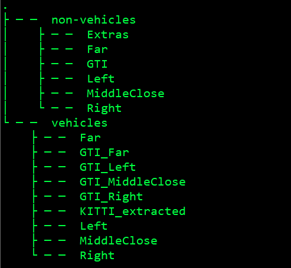
</div>


### Histogram of Oriented Gradients (HOG)

#### 1. extracted HOG features from the training images.

The code for this step is contained in lines 9 - 29 of the file called `functions.py`.  

I started by reading in all the `vehicle` and `non-vehicle` images.  Here is an example of one of each of the `vehicle` and `non-vehicle` classes:

<div class="test">
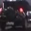
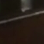
</div>


I then explored different color spaces and different `skimage.hog()` parameters (`orientations`, `pixels_per_cell`, and `cells_per_block`).  I grabbed random images from each of the two classes and displayed them to get a feel for what the `skimage.hog()` output looks like.

Here is an example using the `RGB` color space and HOG parameters of `orientations=9`, `pixels_per_cell=(8, 8)` and `cells_per_block=(2, 2)`:


<div class="test">
Car:
</br>

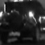
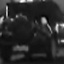
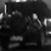
</br>
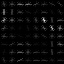
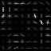
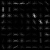
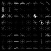
</br>
</br>
NotCar:
</br>

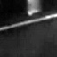
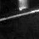
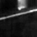
</br>
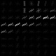

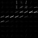

</div>

#### 2. Settled on the final choice of HOG parameters.

I only tried various combinations of parameters:

| Various        | Tried Values   |
|:-------------:|:-------------:|
| color_space     | 'RGB'       |
| orient      | 9     |
| pix_per_cell    | 8      |
| cell_per_block       | 2      |
| hog_channel       | 0, 1, 'ALL'        |


#### 3. train a classifier using HOG\color\binned features.

I trained a SVM  using sklearn.svm.SVC() is contained in lines 100 of the file called `find_cars.py`

### Sliding Window Search

#### 1. Implemented a sliding window search. 

Sliding window parameters I chose:

| Parameters        |Values    |
|:-------------:|:-------------:|
| x_start_stop     | [None, None]       |
| y_start_stop      | [image.shape[0] // 2, None]     |
| xy_window    | [(64, 64)]      |
| xy_overlap       | (0.6, 0.8)      |


<div class="test">
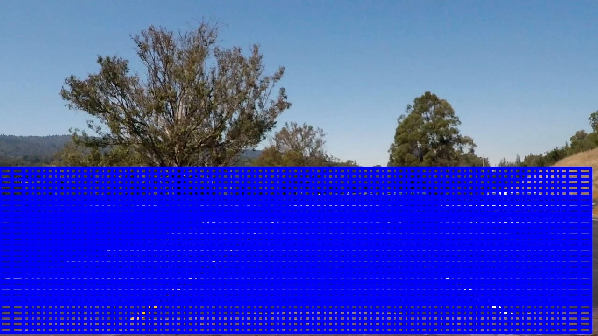
</div>

#### 2. Pipeline:

Ultimately I searched on two scales using RGB 0-channel HOG features plus spatially binned color and histograms of color in the feature vector, which provided a nice result.  Here are some example images:

<div class="test">

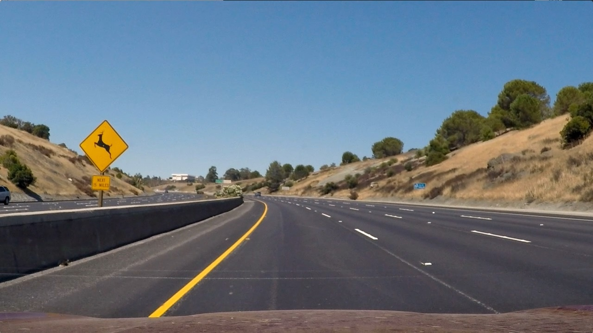
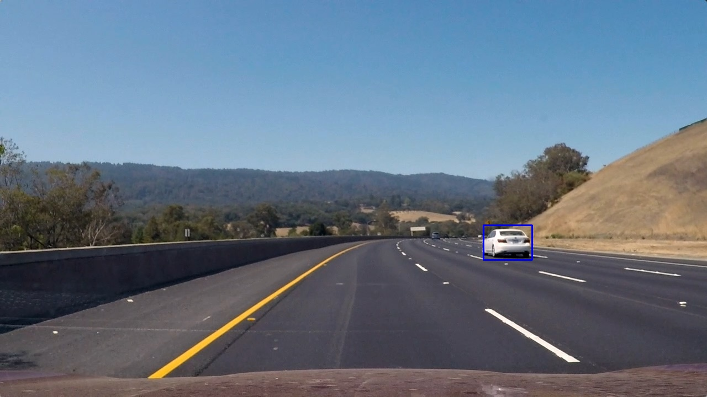
</br>
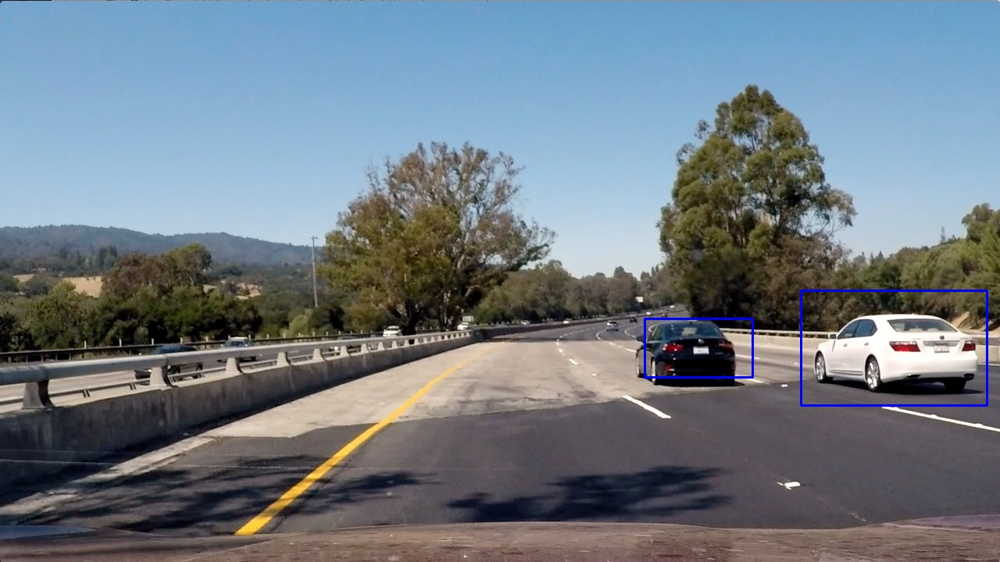

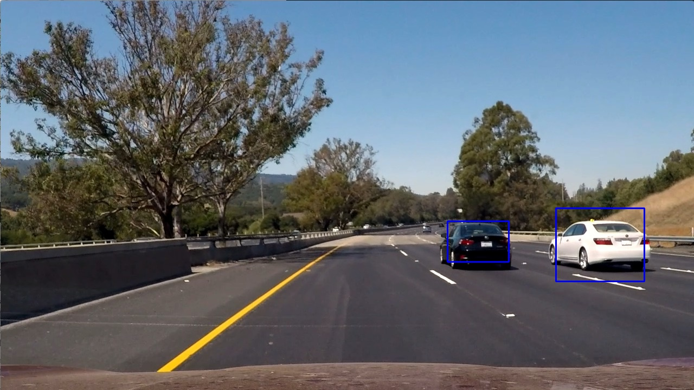
</div>

Use multiprocessing to improve the performance of classifier:
```

    queue_01 = Queue()  # multiprocessing queue
    queue_02 = Queue()  # multiprocessing queue
    lock = Lock()  # multiprocessing lock
    sub_process = []  # multiprocessing sub process list

    for window in windows:
        # get sub imgs by window
        sub_imgs.append(cv2.resize(img[window[0][1]:window[1][1], window[0][0]:window[1][0]], (64, 64))   )


    # use multiprocessing to predict the sub imgs
    # generate data queue
    master_process = Process(target=make_data, args=(queue_01, queue_02, sub_imgs, windows, work_nums, ))

    # generate sub process
    for i in range(work_nums):
        sub_process1 = Process(target=handle_data, args=(queue_01, queue_02, clf, scaler, lock, return_list,))
        sub_process.append(sub_process1)

    # start sub process
    master_process.start()
    for p in sub_process:
        p.start()

    master_process.join()
    for p in sub_process:
        p.join()


```
---

### Video Implementation

#### 1. A link to the final video output:
Here's a [link to my video result](./output_videos/project_video.mp4)


#### 2. Implemented some kind of filter for false positives and some method for combining overlapping bounding boxes.

Here's an example result showing the heatmap from a series of frames of video, the result of `scipy.ndimage.measurements.label()` and the bounding boxes then overlaid on the last frame of video:

### Here are six frames and their corresponding heatmaps:

<div class="test">
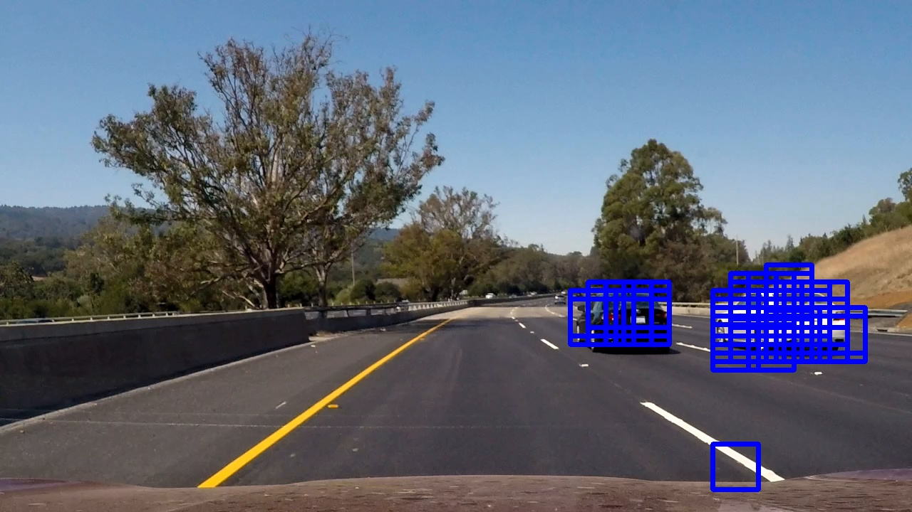

</br>


</br>
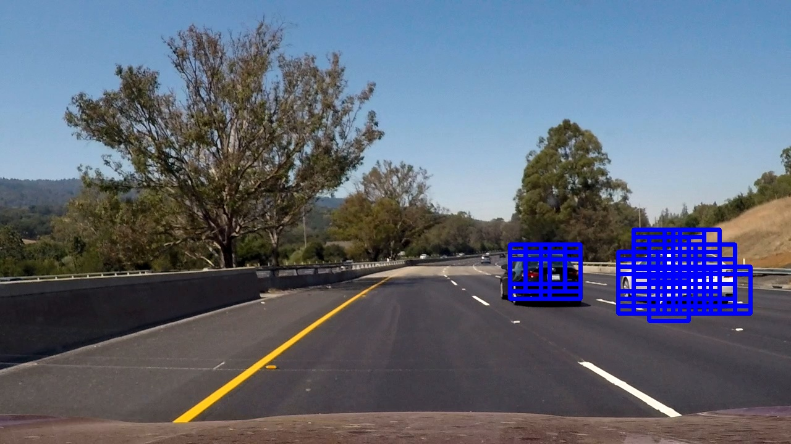
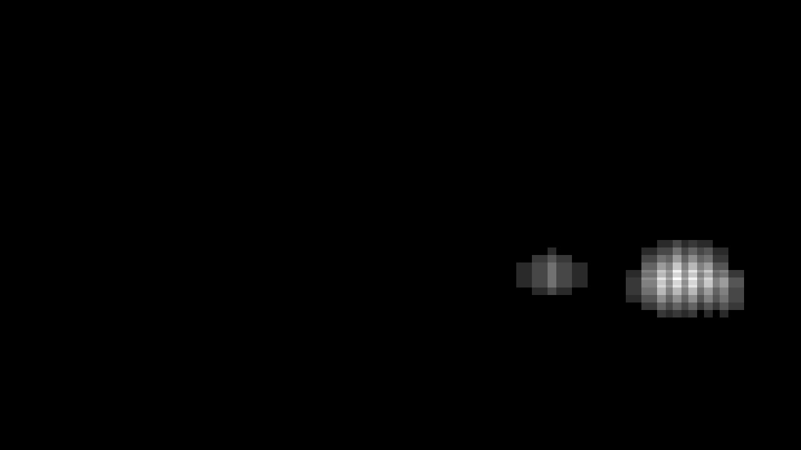
</br>

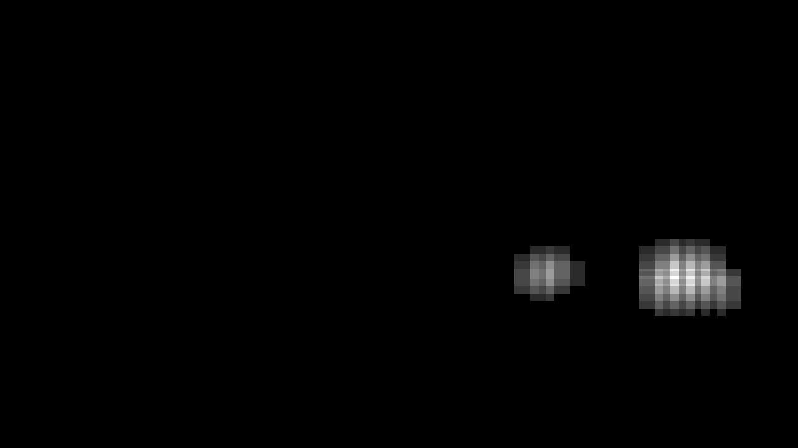
</br>
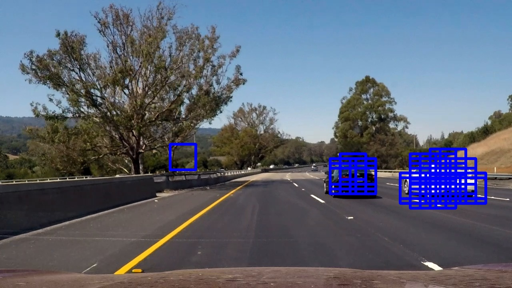
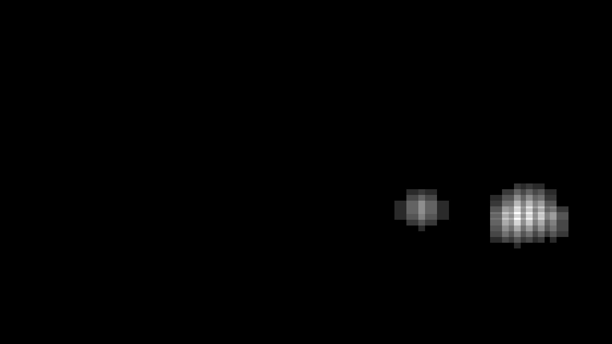
</br>
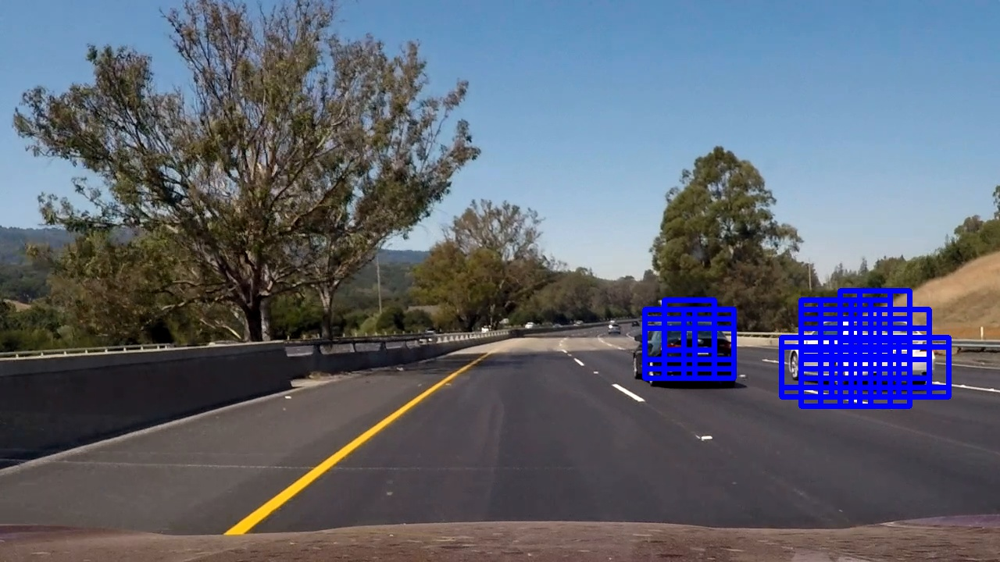
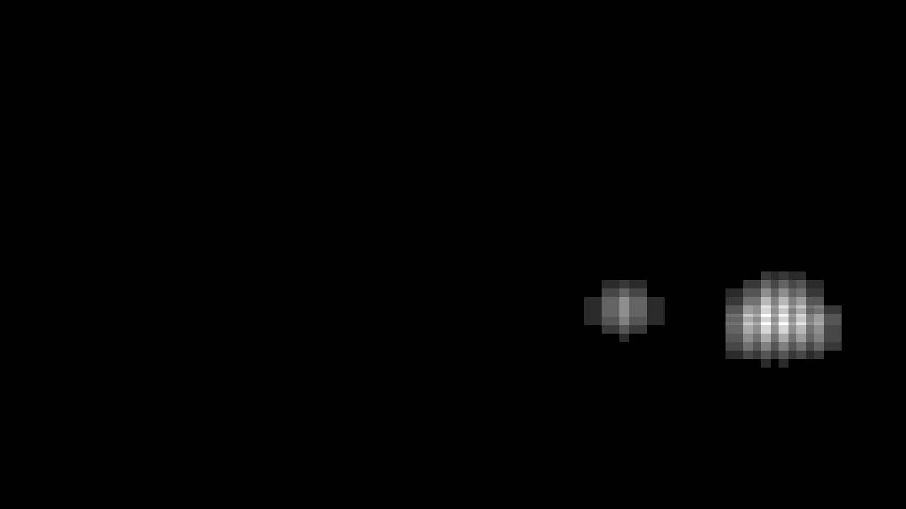
</br>
</div>
### Here is the output of `scipy.ndimage.measurements.label()` on the integrated heatmap from all six frames:

<div class="test">
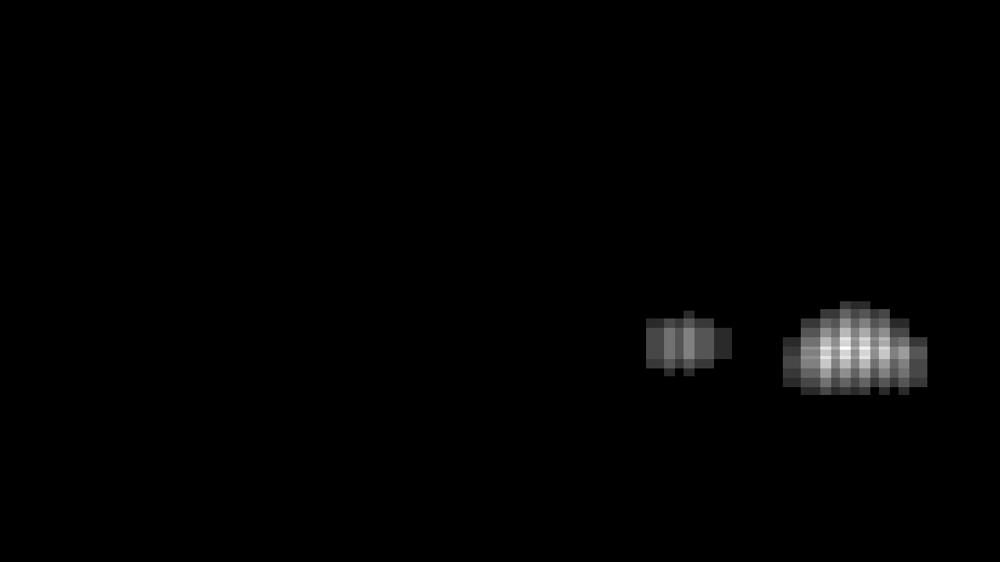
</div>

### Here the resulting bounding boxes are drawn onto the last frame in the series:
<div class="test">

</div>


---

### Discussion

My pipeline function implement too slow, How can I improve it?

### Warning
Execute this project, all CPUs in the computer will be used!

